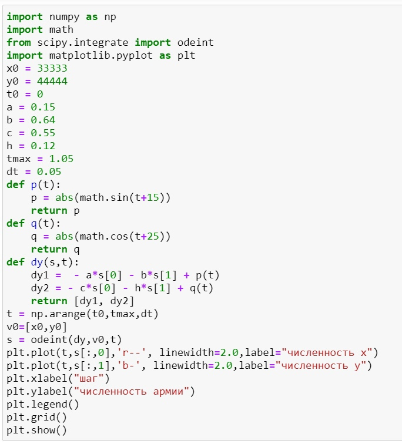
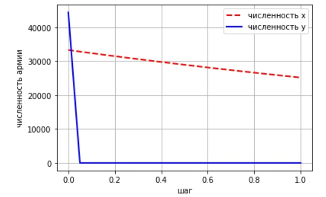

---
## Front matter
lang: ru-RU
title: Модель боевых действий
author: Назарьева Алена НФИбд-03-18
institute:
	inst{1}RUDN University, Moscow, Russian Federation
date: 2021, 25 february
## Formatting
toc: false
slide_level: 2
theme: metropolis
header-includes:
 - \metroset{progressbar=frametitle,sectionpage=progressbar,numbering=fraction}
 - '\makeatletter'
 - '\beamer@ignorenonframefalse'
 - '\makeatother'
aspectratio: 43
section-titles: true
---
# Цель работы

Изучить и реализовать модель боевых действий

# Выполнение лабораторной работы

## 1)

Код в python для модель боевых действий между регулярными войсками (рис. -@fig:001)

{ #fig:001 width=70% }
## 2)

Результат работы программы (рис. -@fig:004)

{ #fig:004 width=70% }

## 3)

Код в python для модель боевых действий между регулярными войсками и
партизанских отрядов (рис. -@fig:002)

{ #fig:002 width=70% }

## 4)

Результат работы программы (рис. -@fig:003)

{ #fig:003 width=70% }

## 5)

Таким образом, в первом случае  война закончится истреблением армии x, а во втором истреблением армии y

# Выводы

В результате проделанной работы я изучила и реализовала модель боевых действий для своего варианта
