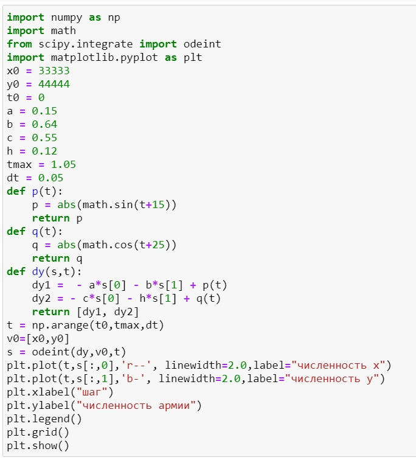
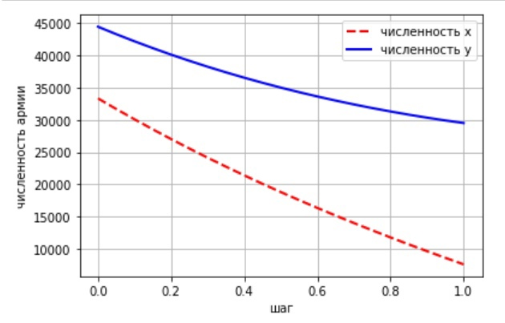
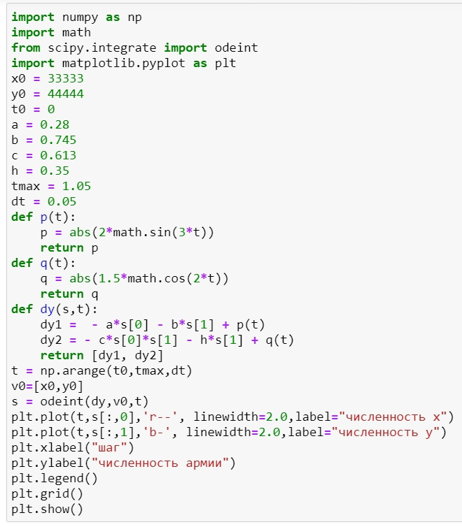
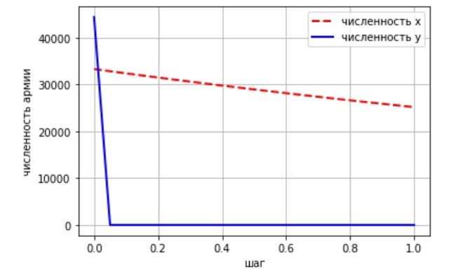

---
# Front matter
lang: ru-RU
title: "Oтчёт по лабораторной работе"
subtitle: "Модель боевых действий"
author: "Назарьева Алена Игоревна НФИбд-03-18"

# Formatting
toc-title: "Содержание"
toc: true # Table of contents
toc_depth: 2
lof: true # List of figures
lot: true # List of tables
fontsize: 12pt
linestretch: 1.5
papersize: a4paper
documentclass: scrreprt
polyglossia-lang: russian
polyglossia-otherlangs: english
mainfont: PT Serif
romanfont: PT Serif
sansfont: PT Sans
monofont: PT Mono
mainfontoptions: Ligatures=TeX
romanfontoptions: Ligatures=TeX
sansfontoptions: Ligatures=TeX,Scale=MatchLowercase
monofontoptions: Scale=MatchLowercase
indent: true
pdf-engine: lualatex
header-includes:
  - \linepenalty=10 # the penalty added to the badness of each line within a paragraph (no associated penalty node) Increasing the value makes tex try to have fewer lines in the paragraph.
  - \interlinepenalty=0 # value of the penalty (node) added after each line of a paragraph.
  - \hyphenpenalty=50 # the penalty for line breaking at an automatically inserted hyphen
  - \exhyphenpenalty=50 # the penalty for line breaking at an explicit hyphen
  - \binoppenalty=700 # the penalty for breaking a line at a binary operator
  - \relpenalty=500 # the penalty for breaking a line at a relation
  - \clubpenalty=150 # extra penalty for breaking after first line of a paragraph
  - \widowpenalty=150 # extra penalty for breaking before last line of a paragraph
  - \displaywidowpenalty=50 # extra penalty for breaking before last line before a display math
  - \brokenpenalty=100 # extra penalty for page breaking after a hyphenated line
  - \predisplaypenalty=10000 # penalty for breaking before a display
  - \postdisplaypenalty=0 # penalty for breaking after a display
  - \floatingpenalty = 20000 # penalty for splitting an insertion (can only be split footnote in standard LaTeX)
  - \raggedbottom # or \flushbottom
  - \usepackage{float} # keep figures where there are in the text
  - \floatplacement{figure}{H} # keep figures where there are in the text
---

# Цель работы

Изучить и реализовать модель боевых действий

# Задание

Между страной Х и страной У идет война. Численность состава войск исчисляется от начала войны, и являются временными функциями x(t) и y(t). В начальный момент времени страна Х имеет армию численностью 33 333 человек, а
в распоряжении страны У армия численностью в 44 444 человек. Для упрощения модели считаем, что коэффициенты
a, b, c, h постоянны. Также считаем P(t) и Q(t) непрерывные функции.
Постройте графики изменения численности войск армии Х и армии У для следующих случаев:
1. Модель боевых действий между регулярными войсками
dx/dt= -0,15x(t)-0,64y(t)+|sin(t+15)|
dy/dt= -0,55x(t)-0,12y(t)+|cos(t+25)|
2. Модель ведение боевых действий с участием регулярных войск и
партизанских отрядов
dx/dt=-0,28x(t)-0,745y(t)+|2sin(3t)|
dy/dt=-0,613x(t)y(t)-0,35x(t)+|1,5cos(2t)|

# Теоретическая справка

Рассмотрим некоторые простейшие модели боевых действий – модели
Ланчестера. В противоборстве могут принимать участие как регулярные войска,
так и партизанские отряды. В общем случае главной характеристикой соперников
являются численности сторон. Если в какой-то момент времени одна из
численностей обращается в нуль, то данная сторона считается проигравшей (при
условии, что численность другой стороны в данный момент положительна).
Рассмотри три случая ведения боевых действий:
1. Боевые действия между регулярными войсками
2. Боевые действия с участием регулярных войск и партизанских
отрядов
3. Боевые действия между партизанскими отрядами
В первом случае численность регулярных войск определяется тремя
факторами:
 - скорость уменьшения численности войск из-за причин, не связанных с
боевыми действиями (болезни, травмы, дезертирство);
 - скорость потерь, обусловленных боевыми действиями
противоборствующих сторон (что связанно с качеством стратегии,
уровнем вооружения, профессионализмом солдат и т.п.);
 - скорость поступления подкрепления (задаётся некоторой функцией от
времени).
В этом случае модель боевых действий между регулярными войсками
описывается следующим образом
dx/dt= -a(t)x(t)-b(t)y(t)+p(t)
dy/dt= -c(t)x(t)-h(t)y(t)+q(t)
(1)
Потери, не связанные с боевыми действиями, описывают члены a(t)x(t) и h(t)y(t), члены b(t)y(t) и c(t)x(t) отражают потери на поле боя.
Коэффициенты b(t) и c(t) указывают на эффективность боевых действий со стороны у и х соответственно, a(t),h(t)- величины, характеризующие степень влияния различных факторов на потери. Функции P(t), Q(t) учитывают возможность подхода подкрепления к войскам Х и У в течение одного дня.
Во втором случае в борьбу добавляются партизанские отряды. Нерегулярные войска в отличии от постоянной армии менее уязвимы, так как действуют скрытно, в этом случае сопернику приходится действовать неизбирательно, по площадям,
занимаемым партизанами. Поэтому считается, что тем потерь партизан,
проводящих свои операции в разных местах на некоторой известной территории, пропорционален не только численности армейских соединений, но и численности самих партизан. В результате модель принимает вид:
dx/dt= -a(t)x(t)-b(t)y(t)+p(t)
dy/dt= -c(t)x(t)y(t)-h(t)y(t)+q(t)
В этой системе все величины имею тот же смысл, что и в системе (1).
Модель ведение боевых действий между партизанскими отрядами с учетом
предположений, сделанном в предыдущем случаем, имеет вид:
dx/dt= -a(t)x(t)-b(t)y(t)x(t)+p(t)
dy/dt= -c(t)x(t)y(t)-h(t)y(t)+q(t)
В простейшей модели борьбы двух противников коэффициенты b(t) и c(t)
являются постоянными. Попросту говоря, предполагается, что каждый солдат армии x убивает за единицу времени c солдат армии y (и, соответственно, каждый солдат армии y убивает b солдат армии x). Также не учитываются потери, не связанные с боевыми действиями, и возможность подхода подкрепления.

# Выполнение лабораторной работы

1. Код в python для модель боевых действий между регулярными войсками (рис. -@fig:001)

{ #fig:001 width=70% }

Результат работы программы (рис. -@fig:004)

{ #fig:004 width=70% }

2. Код в python для модель боевых действий между регулярными войсками и
партизанских отрядов (рис. -@fig:002)

{ #fig:002 width=70% }

Результат работы программы (рис. -@fig:003)

{ #fig:003 width=70% }

Таким образом, в первом случае  война закончится истреблением армии x, а во втором истреблением армии y

# Выводы

В результате проделанной работы я изучила модель боевых действий
